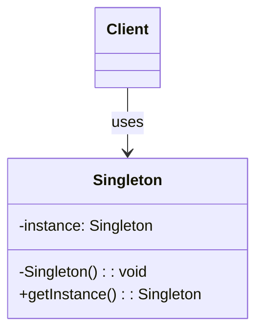

# Singleton pattern

Singleton Pattern is a creational design pattern that guarantees a class has only one instance and provides a global point of access to it.


## Contents

## Implementation

To implement the singleton pattern, we must prevent external objects from creating instances of the singleton class. Only the singleton class should be permitted to create its own objects.

Additionally, we need to provide a method for external objects to access the singleton object.

This can be achieved by making the constructor private and providing a static method for external objects to access it.



Ways to implement the singleton pattern -

### 1. Lazy Initialization

This approach creates the singleton instance only when it is needed, saving resources if the singleton is never used in the application.

#### Code
1. Checks if an instance already exists (instance == null).
2. If not, it creates a new instance.
3. If an instance already exists, it skips the creation step.


```java
public class Singleton {
    private static Singleton instance;

    private Singleton() {
        // private constructor to prevent instantiation
    }

    public static Singleton getInstance() {
        if (instance == null) {
            instance = new Singleton();
        }
        return instance;
    }
}
```


#### pros:
- Controlled access to the sole instance
- Reduced memory footprint
- Global point of access
#### cons:
- Not thread-safe; requires synchronization for multi-threaded applications


### 2. Thread-Safe Singleton

Same as lazy initialization, but with added synchronization to ensure thread safety.

#### Code

This is achieved by making the getInstance() method synchronized ensuring only one thread can execute this method at a time.
When a thread enters the synchronized method, it acquires a lock on the class object. Other threads must wait until the method is executed.


1. The synchronization keyword ensures that only one thread can perform the (instance == null) check and create the object.
2. If another thread tries to access the getInstance() method while one thread is already executing it, it will wait until the first thread completes its execution.


```java
public class Singleton {
    private static Singleton instance;

    private Singleton() {
        // private constructor to prevent instantiation
    }

    public static synchronized Singleton getInstance() {
        if (instance == null) {
            instance = new Singleton();
        }
        return instance;
    }
}
```

#### pros:
- Controlled access to the sole instance
- Thread-safe
- Global point of access
#### cons:
- Performance overhead due to synchronization
- Can lead to contention in multi-threaded applications

* **contention** refers to the competition among multiple threads for access to shared resources. when one thread acquires a lock on a shared resource, and other threads that also need to access that same resource are forced to wait until the first thread releases the lock. This waiting period is a form of contention and can lead to performance bottlenecks, as threads are not able to execute concurrently as intended.

### 3. Double-Checked Locking

This approach minimizes performance overhead from synchronization by only synchronizing when the object is first created.

It uses the volatile keyword to ensure that changes to the instance variable are immediately visible to other threads.

#### Code
- If the first check (instance == null) passes, we synchronize on the class object.

- We check the same condition one more time because multiple threads may have passed the first check.

- The instance is created only if both checks pass.

```java
// highlight=1
public class Singleton {
    private static volatile Singleton instance;

    private Singleton() {
        // private constructor to prevent instantiation
    }

    public static Singleton getInstance() {
        if (instance == null) {
            synchronized (Singleton.class) {
                if (instance == null) {
                    instance = new Singleton();
                }
            }
        }
        return instance;
    }
}
```
