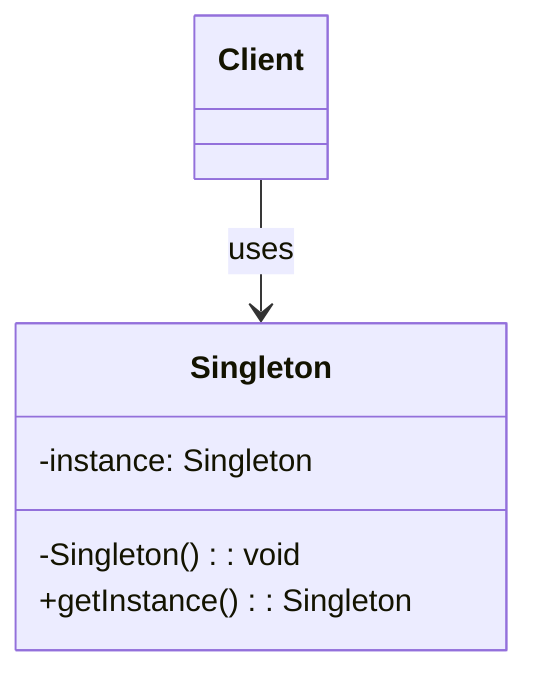

# Singleton pattern

Singleton Pattern is a creational design pattern that guarantees a class has only one instance and provides a global point of access to it.


## Contents

## Implementation

To implement the singleton pattern, we must prevent external objects from creating instances of the singleton class. Only the singleton class should be permitted to create its own objects.

Additionally, we need to provide a method for external objects to access the singleton object.

This can be achieved by making the constructor private and providing a static method for external objects to access it.



Ways to implement the singleton pattern -

### 1. Lazy Initialization

This approach creates the singleton instance only when it is needed, saving resources if the singleton is never used in the application.

#### Code
1. Checks if an instance already exists (instance == null).
2. If not, it creates a new instance.
3. If an instance already exists, it skips the creation step.


```java
public class Singleton {
    private static Singleton instance;

    private Singleton() {
        // private constructor to prevent instantiation
    }

    public static Singleton getInstance() {
        if (instance == null) {
            instance = new Singleton();
        }
        return instance;
    }
}
```


#### pros:
- Controlled access to the sole instance
- Reduced memory footprint
- Global point of access
#### cons:
- Not thread-safe; requires synchronization for multi-threaded applications


### 2. Thread-Safe Singleton

Same as lazy initialization, but with added synchronization to ensure thread safety.

#### Code

This is achieved by making the getInstance() method synchronized ensuring only one thread can execute this method at a time.
When a thread enters the synchronized method, it acquires a lock on the class object. Other threads must wait until the method is executed.


1. The synchronization keyword ensures that only one thread can perform the (instance == null) check and create the object.
2. If another thread tries to access the getInstance() method while one thread is already executing it, it will wait until the first thread completes its execution.


```java
public class Singleton {
    private static Singleton instance;

    private Singleton() {
        // private constructor to prevent instantiation
    }

    public static synchronized Singleton getInstance() {
        if (instance == null) {
            instance = new Singleton();
        }
        return instance;
    }
}
```

#### pros:
- Controlled access to the sole instance
- Thread-safe
- Global point of access
#### cons:
- Performance overhead due to synchronization
- Can lead to contention* in multi-threaded applications

\* **contention** refers to the competition among multiple threads for access to shared resources. when one thread acquires a lock on a shared resource, and other threads that also need to access that same resource are forced to wait until the first thread releases the lock. This waiting period is a form of contention and can lead to performance bottlenecks, as threads are not able to execute concurrently as intended.

### 3. Double-Checked Locking

This approach minimizes performance overhead from synchronization by only synchronizing when the object is first created.

It uses the volatile keyword to ensure that changes to the instance variable are immediately visible to other threads.

#### Code
- If the first check `(instance == null)` passes, we synchronize on the class object.

- We check the same condition one more time because multiple threads may have passed the first check.

- The instance is created only if both checks pass.

```java
// highlight=10-14
public class Singleton {
    private static volatile Singleton instance;

    private Singleton() {
        // private constructor to prevent instantiation
    }

    public static Singleton getInstance() {
        if (instance == null) {
            synchronized (Singleton.class) {
                if (instance == null) {
                    instance = new Singleton();
                }
            }
        }
        return instance;
    }
}
```

#### pros:
- Controlled access to the sole instance
- Thread-safe
- Reduced performance overhead compared to synchronized method
#### cons:
- More complex implementation
- Still has some performance overhead due to synchronization

### 4. Eager Initialization

This approach creates the singleton instance at the time of class loading, ensuring that the instance is always available when needed.

In this method, we rely on the JVM to create the singleton instance when the class is loaded. The JVM guarantees that the instance will be created before any thread access the instance variable.

This implementation is one of the simplest and inherently thread-safe without needing explicit synchronization.

#### Code

* The `static variable` ensures there's only one instance shared across all instances of the class.
* `final` prevents the instance from being reassigned after initialization

```java
// highlight=2
public class Singleton {
    private static final Singleton instance = new Singleton();

    private Singleton() {
        // private constructor to prevent instantiation
    }

    public static Singleton getInstance() {
        return instance;
    }
}
```

#### pros:
- Simple and easy to implement
- Thread-safe without synchronization
- Instance is created at class loading time, ensuring it's always available
#### cons:
- Instance is created even if it's never used, which can lead to unnecessary resource consumption


### 5. Bill Pugh Singleton or Lazy Holder Singleton
This is a variation of the lazy initialization pattern that uses a static inner helper class to hold the

This implementation uses a static inner helper class to hold the singleton instance. The inner class is not loaded into memory until it's referenced for the first time in the getInstance() method.

It is thread-safe without requiring explicit synchronization.

The Bill Pugh Singleton implementation, while more complex than Eager Initialization provides a perfect balance of lazy initialization, thread safety, and performance, without the complexities of some other patterns like double-checked locking.

#### Code

- When the `getInstance()` method is called for the first time, it triggers the loading of the SingletonHelper class.

- When the inner class is loaded, it creates the `INSTANCE` of BillPughSingleton.

- The final keyword ensures that the `INSTANCE` cannot be reassigned.

```java
public class BillPughSingleton {
    private BillPughSingleton() {
        // private constructor to prevent instantiation
    }

    private static class SingletonHelper {
        private static final BillPughSingleton INSTANCE = new BillPughSingleton();
    }

    public static BillPughSingleton getInstance() {
        return SingletonHelper.INSTANCE;
    }
}
```

#### pros:
- Thread-safe without synchronization
- Lazy initialization
- No performance overhead from synchronization
#### cons:
- More complex implementation

### 6. Enum Singleton
In this method, the singleton is declared as an enum rather than a class.

Java ensures that only one instance of an enum value is created, even in a multithreaded environment.

The Enum Singleton pattern is the most robust and concise way to implement a singleton in Java.

#### Code

```java
// highlight=2,10
public enum EnumSingleton {
    INSTANCE;

    // Add any necessary methods here
}

// Usage
public class Main {
    public static void main(String[] args) {
        EnumSingleton singleton = EnumSingleton.INSTANCE;
        // Use the singleton instance
    }
}
```

#### pros:
- Simple and concise implementation
- Thread-safe by design
- No need for synchronization
#### cons:
- Cannot extend the enum class, limiting flexibility

### 7. Static Block Initialization
This is similar to eager initialization, but the instance is created in a static block.

It provides the ability to handle exceptions during instance creation, which is not possible with simple eager initialization.

#### Code
```java
// highlight=4-10,17
public class StaticBlockSingleton {
    private static StaticBlockSingleton instance;

    static {
        try {
            instance = new StaticBlockSingleton();
        } catch (Exception e) {
            throw new RuntimeException("Exception occurred while creating singleton instance", e);
        }
    }

    private StaticBlockSingleton() {
        // private constructor to prevent instantiation
    }

    public static StaticBlockSingleton getInstance() {
        return instance;
    }
}
```


#### pros:
- Simple and easy to implement
- Thread-safe without synchronization
- Allows exception handling during instance creation
#### cons:
- More complex implementation
- Instance is created at class loading time, which can lead to unnecessary resource consumption if the instance is never used


### 8. ThreadLocal Singleton
This approach uses a ThreadLocal variable to ensure that each thread has its own instance of the singleton.
This is useful in scenarios where each thread needs its own instance of the singleton, such as in web applications where each request is handled by a separate thread.

#### Code

```java
public class ThreadLocalSingleton {
    private static ThreadLocal<ThreadLocalSingleton> instance = ThreadLocal.withInitial(ThreadLocalSingleton::new);

    private ThreadLocalSingleton() {
        // private constructor to prevent instantiation
    }

    public static ThreadLocalSingleton getInstance() {
        return instance.get();
    }
}
```

#### pros:
- Each thread has its own instance, avoiding contention
- Reduces memory footprint by not sharing instances between threads
- Useful in multi-threaded applications where each thread needs its own instance
#### cons:
- Increased complexity
- Not suitable for scenarios where a single instance is needed across all threads

### 9. Registry Singleton
This approach allows for multiple singleton instances, each identified by a unique key. It provides a registry to manage these instances.

#### Code

```java
import java.util.HashMap;
import java.util.Map;

public class RegistrySingleton {
    private static Map<String, RegistrySingleton> instances = new HashMap<>();

    private RegistrySingleton() {
        // private constructor to prevent instantiation
    }

    public static RegistrySingleton getInstance(String key) {
        return instances.computeIfAbsent(key, k -> new RegistrySingleton());
    }
}
```

#### pros:
- Allows for multiple singleton instances identified by unique keys
- Provides a centralized registry for managing instances
- Can be useful in scenarios where different configurations are needed for different instances
#### cons:
- Increased complexity
- Potential memory overhead due to storing multiple instances
- Synchronization may be needed if accessed by multiple threads
