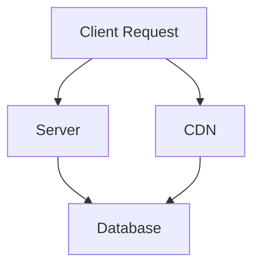
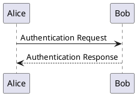
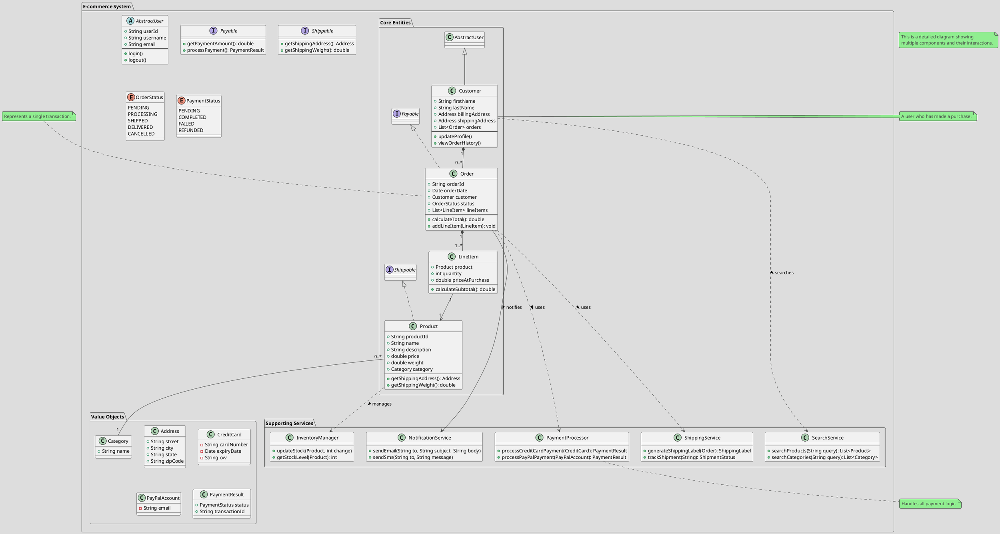

export const metadata = {
  title: 'Example MDX File',
  description: 'An example MDX file demonstrating various code snippets and features.',
  keywords: ['MDX', 'example', 'code snippets'],
  authors: [{ name: 'John Doe', url: 'https://example.com' }],
}

# Example MDX File

This is an example MDX file that demonstrates various code snippets and features.


### Contents

### Quote
> This is a quote from the MDX file.

> asdsfs

<SuccessQuote>
custom SuccessQuote content
dasf

dsafdaf
</SuccessQuote>


<ErrorQuote>
custom ErrorQuote content
dasf

dsafdaf
</ErrorQuote>

<InfoQuote>
custom InfoQuote content
dasf

dsafdaf
</InfoQuote>

## Inline code

hello - `hello this is inline code` ddd

## Mermaid Diagram



## PlantUML Diagram



## Server-Side Rendering Example

```javascript
// pages/blog/[id].js
export async function getServerSideProps(context) {
  const { params } = context;
  const data = await fetchData(params.id);
  
  return {
    props: {
      data,
    },
  };
}

export default function Page({ data }) {
  return (
    <div>
      <h1>{data.title}</h1>
      <p>{data.content}</p>
    </div>
  );
}
```

## Static Site Generation

```typescript
// lib/posts.ts
interface Post {
  id: string;
  title: string;
  content: string;
}

export async function getStaticProps(): Promise<{ props: { posts: Post[] } }> {
  const posts = await getAllPosts();
  
  return {
    props: {
      posts,
    },
    revalidate: 60, // Revalidate every 60 seconds
  };
}
```

## React Component Example

```jsx
// components/UserProfile.jsx highlight=6-7,15-17,26-30
import { useState, useEffect } from 'react';

export default function UserProfile({ userId }) {
  const [user, setUser] = useState(null);
  const [loading, setLoading] = useState(true);

  useEffect(() => {
    async function fetchUser() {
      try {
        const response = await fetch(`/api/users/${userId}`);
        const userData = await response.json();
        setUser(userData);
      } catch (error) {
        console.error('Failed to fetch user:', error);
      } finally {
        setLoading(false);
      }
    }

    fetchUser();
  }, [userId]);

  if (loading) return <div>Loading...</div>;
  if (!user) return <div>User not found</div>;

  return (
    <div className="user-profile">
      
      <h1>{user.name}</h1>
      <p>{user.bio}</p>
    </div>
  );
}
```

## Highlighted Example without Filename

```typescript
// highlight=1,3-5,8
interface ApiResponse<T> {
  data: T;
  success: boolean;
  message?: string;
  timestamp: number;
}

async function fetchData<T>(url: string): Promise<ApiResponse<T>> {
  const response = await fetch(url);
  return response.json();
}
```

## Long Line Example (Test Horizontal Scrolling)

```javascript
// test.js highlight=2
const shortLine = 'This is a short line';
const veryLongLineToTestHorizontalScrolling = 'This is a very long line that should definitely cause horizontal scrolling in the code block to test if the scrollbar appears and works correctly when content extends beyond the container width';
const anotherShortLine = 'Short';
```


## PlantUML big Diagram

